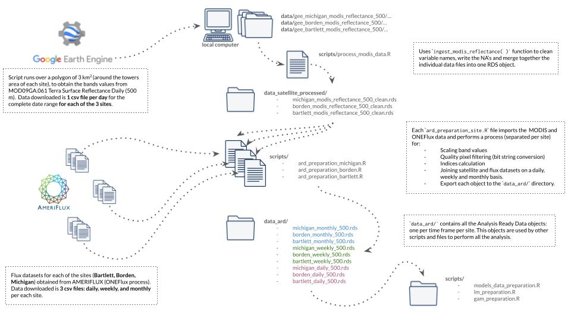

# Assessing uncertainties related to the use of satellite remote sensing indices to estimate Gross Primary Production

 

 - This is a repository by [Ronny A. Hernández Mora](https://ronnyale.com/) that contains all
 the code and text to produce my [thesis document](https://github.com/ronnyhdez/thesis_msc/blob/main/thesis_docs/Assessing-uncertainties-related-to-the-use-of-satellite-remote-sensing-indices-to-estimate-Gross-Primary-Production_v0.0.6.pdf).
 - This repository also contains my [slides](https://github.com/ronnyhdez/thesis_msc/blob/main/thesis_docs/thesis_presentation_v0.0.3.pdf) used in my MSc defense

:warning: Thesis dissertation may differ from the official document submitted to
the University of Alberta Faculty of Graduate Studies & Research in aspects such
as  **text format**, **references section position**, or **first page structure**.
However, these differences relate to formatting rather than content or data 
analysis results.

## :open_book: Open Science Statement

All materials, data, and code required to reproduce my research and thesis are 
made available here, to the best of my knowledge and abilities.

If you encounter an error while attempting to replicate a part of the analysis, 
please inform me by [creating an issue](https://github.com/ronnyhdez/thesis_msc/issues/new). 

## :twisted_rightwards_arrows: Data flow diagram

## Citation Guidelines

For referencing the code included in this repository, please use the following 
citation format:

> Hernández Mora, R. A. (2024). Assessing uncertainties related to the use of satellite remote sensing indices to estimate Gross Primary Production: Code and source files. (v0.0.7). Zenodo. https://doi.org/10.5281/zenodo.10882134

If you are solely referencing my thesis document, please use the following 
citation:

> pending update

## Acknowledgments

**My research and MSc was funded by**:

 - Earth Observations for Regional Cumulative Effects - Research Affiliate Program
from the Canada Centre for Remote Sensing.
 - Graduate Students' Association Academic Travel Grant (University of Alberta)
 - Mary Louise Imrie Graduate Student Award (University of Alberta)

**Supervised by**

 - Richard Fernandes. Canada Centre for Remote Sensing, Natural Resources Canada
 - Arturo Sánchez Azofeifa. Department of Earth & Atmospheric Sciences, University of Alberta
 

  

